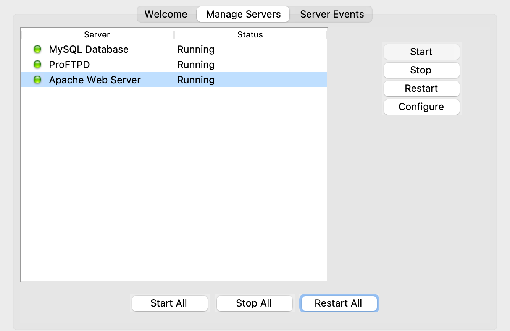
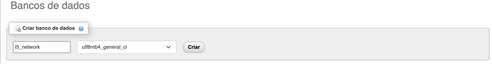

# TESTE ANALISTA JÚNIOR

## Objetivos do teste

Neste teste você dispõe de um cenário fictício, onde há um painel de monitoramento de ramais que contem alguns bugs que precisam ser corrigidos. Este painel também deverá ser melhorado, o minimo de melhorias que deverá ser acrescentado serão 3. Abaixo uma relação dos itens que deverão ser corrigidos:

- Os ramais offiline não são exibidos corretamente no painel, para corrigir você deverá exibir os ramais indisponiveis, fazendo com que o card do painel fique cinza e traga um icone circular no canto superior direito com a cor cinza mais escura. 
- Os ramais que estão em pausa no grupo de callcenter não estão sendo exibidos corretamente, para corrigir você deverá exibir os ramais que estão com com status de pausa, trazendo um icone circular no canto superior direito com a cor laranja.
- Os card deverão exibir os nomes dos agentes que estão no grupo de callcenter SUPORTE (arquivo lib\filas)

### MELHORIAS  
Após a correção destes itens, você deverá aplicar ao menos 3 (três) melhorias neste sistema.

### OBRIGATÓRIO  
O teste também contará com algumas atividades obrigatórias:
- Transformar o arquivo lib\ramais.php em uma classe e utiliza-lo neste sistema. Após a criação da classe o arquivo lib\ramais.php não deverá ser mais utilizado.
- Apesar dos registros serem estaticos, deverá ser criada uma base de dados utilizando mysql ou mariadb para armazenar as informações de cada ramal, como numero, nome, IP,  status do ramal no grupo de callcente (disponivel, pausa, offiline, etc).
- As informações da tela devem ser atualizadas a cada 10 segundos utilizando ajax e estas informações devem ser atualizadas na base de dados. Para verificar se está sendo atualizado na base de dados você poderá alterar as informações dos arquivos  lib\filas e lib\ramais

### IMPORTANTE
0. Você não podera utilizar frameworks, o código terá de ser 100% seu.
1. O arquivo lib\filas simula as informações de um grupo de callcenter  
2. O arquivo lib\ramais simula as informações dos ramais  
3. Estes arquivos se completam  
4. Estes arquivos NÃO devem unidos em um só arquivo  
5. Estes arquivos poderão ser alterados apenas para teste do AJAX  
6. Ao concluir o teste, deverá ser encaminhado um arquivo .zip contendo todo o código, dump da base de dados e instruções de instalação e a lista das melhorias aplicadas. 

## SOLUÇÃO DO TESTE

### Correção de Bugs

1. **Exibição de Ramais Offline:**
Corrigido o problema onde os ramais offline não eram exibidos corretamente no painel.
Os ramais indisponíveis agora são exibidos com o card cinza e um ícone circular no canto superior direito com a cor cinza mais escura.

2. **Exibição de Ramais em Pausa:**
Corrigido o problema onde os ramais em pausa no grupo de call center não eram exibidos corretamente.
Os ramais em pausa agora são exibidos com um ícone circular no canto superior direito com a cor laranja.

3. **Exibição de Nomes de Agentes no Grupo de Callcenter SUPORTE:**
Agora os cards exibem os nomes dos agentes que estão no grupo de call center "SUPORTE", utilizando as informações do arquivo lib/filas.

### Implementações

1. **Transformação do Arquivo lib/ramais.php em uma Classe:**
O arquivo lib/ramais.php foi em uma classe para melhor organização e reutilização de código.
A classe Ramais agora é utilizada neste sistema para obter informações sobre os ramais.

2. **Criação de uma Base de Dados MySQL:**
Uma base de dados MySQL foi criada para armazenar as informações de cada ramal, incluindo número, nome, IP e status no grupo de call center.

3. **Atualização Automática das Informações a Cada 10 Segundos:**
Implementada a atualização automática das informações da tela a cada 10 segundos utilizando AJAX.
As informações também são atualizadas na base de dados, garantindo consistência entre o painel e os dados armazenados.

4. **Adição de Rotas e Arquitetura MVC no PHP:**
- Implementação de rotas para gerenciar as requisições HTTP e direcioná-las para os controladores apropriados.
- Migração do projeto para a arquitetura MVC, separando as responsabilidades de modelo, visualização e controle para melhor organização do código.
- Os controladores são responsáveis por receber as requisições, processar os dados e interagir com os modelos e as visualizações.

### Melhorias Implementadas

1. **Filtro para Otimizar a Busca dos Ramais:**
Adicionado um filtro para permitir que os usuários do sistema busquem rapidamente os ramais com base em critérios específicos, como número ou nome do usuário.

2. **Ícones para Facilitar a Visualização:**
Incluídos ícones para representar visualmente as informações dos ramais e dos usuários.

3. **Modal para Mostrar Detalhamentos do Ramal:**
- Implementado um modal para exibir detalhes adicionais do ramal, como número, nome, status e outras informações relevantes.
- O modal pode ser expandido no futuro para incluir mais informações, conforme necessário.

4. **Adição de Cores no Fundo do Card de Acordo com o Status do Ramal:**
- Adicionadas cores de fundo nos cards para refletir o status atual do ramal.
- As cores facilitam a identificação visual dos diferentes estados dos ramais, tornando a interface mais intuitiva e fácil de entender.

### Pré-requisitos

Para solucionar o este desafio utilizei o ambiente do Xampp para rodar o Apache e o MySQL.
Antes de começar, caso queira seguir o passo a passo, tenha em sua máquina o Xampp instalado para mais informações acesse [XAMPP](https://www.apachefriends.org/pt_br/index.html).

Além disto é bom ter um editor para trabalhar com o código como [VSCode](https://code.visualstudio.com/)

### 🎲 Rodando o Projeto

#### Clonando o Repositório
1. Abra o terminal.
2. Navegue até o diretório do XAMPP usando o comando cd.
3. Em seguida, navegue até o diretório htdocs com o comando cd htdocs.
4. Clone o repositório do GitHub usando o comando:
```bash
git clone https://github.com/Bruno-Lafayette/programador_junior-master.git
```

#### Configurando o Servidor no XAMPP

1. Abra o aplicativo XAMPP.
2. No painel de controle, clique em **'Manage Servers'**.
3. Em seguida, clique em **'start all'** para iniciar todos os servidores.



#### Configurando o Banco de Dados

1. Abra um navegador e acesse a URL:

```bash
http://localhost/phpmyadmin/index.php?route=/server/databases
```

2. Crie um novo banco de dados com o nome l5_network.



3. No lado direito, selecione o banco de dados l5_network.
4. Selecione a opção "importar".
5. Selecione o arquivo l5_network.sql fornecido na pasta.


6. No final da página, clique no botão "importar" para importar o arquivo SQL.

#### Executando o Sistema

1. Após concluir os passos anteriores sem erros, abra um navegador da sua preferência.
2. Cole a seguinte URL na barra de endereço:

```Bash
http://localhost/programador_junior-master/
```

3. O sistema estará pronto para uso.
